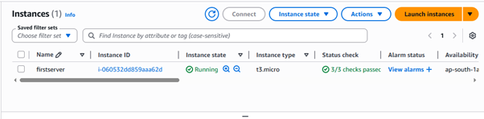
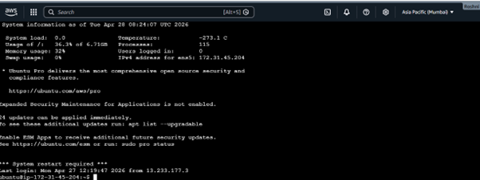
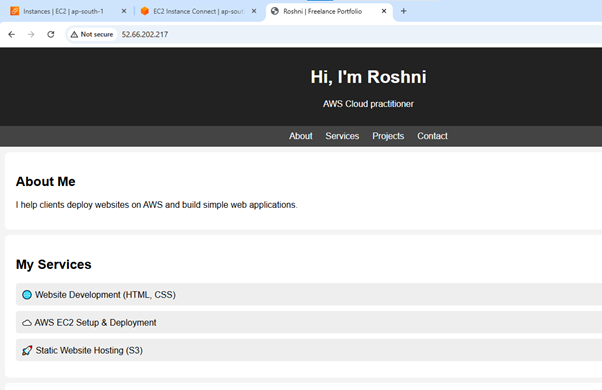

AWS Cloud Portfolio

👩‍💻 About Me

I am a Cloud Computing learner focused on building hands-on projects using AWS services.
I have created real-world projects to understand deployment, storage, and security in cloud environments.

---

🚀 Project 1: EC2 Website Deployment

🔹 What I Did

- Launched an EC2 instance
- Installed Apache Web Server
- Deployed a static website
- Accessed website using public IP

🔹 How I Did

- Connected to EC2 using SSH
- Installed Apache:
  sudo apt update
  sudo apt install apache2
- Uploaded website files to /var/www/html
- Verified deployment in browser

🔹 Output

Website successfully hosted and accessible via public IP

🔹 Screenshots

🚀 Project 2: S3 Static Website Hosting

🔹 What I Did

- Created S3 bucket
- Enabled static website hosting
- Uploaded website files
- Made content publicly accessible

🔹 How I Did

- Configured bucket permissions
- Disabled block public access
- Added bucket policy
- Used S3 endpoint URL to access site

🔹 Output

Website successfully hosted using S3 URL

🔹 Screenshots

(Add S3 screenshots here)

---

🚀 Project 3: IAM User Setup

🔹 What I Did

- Created IAM user
- Assigned permissions using policies
- Enabled secure login

🔹 How I Did

- Used AWS IAM dashboard
- Attached predefined policies
- Generated login credentials

🔹 Output

Secure IAM user created with controlled access

🔹 Screenshots

(Add IAM screenshots here)

---

🛠️ Skills Gained

- AWS EC2
- AWS S3
- IAM (Identity & Access Management)
- Linux Commands
- Basic Cloud Security

---

🎯 Conclusion

These projects helped me understand real-world cloud deployment, storage, and access control.
